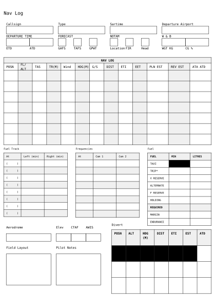

# Navigation Logger
<div align="center">Version 0.1.0</div>

A Navigation Log, developed to replace multiple pages of notes and provide a succinct template to manage all the information needed as a Cross Country Pilot!

## Template adaptation checklist

- [ ] Check and/or replace `LICENSE` by something that suits your needs
- [ ] Adapt Repository URLs in `CHANGELOG.md`
  - Consider only committing that file with your first release, or removing the "Initial Release" part in the beginning
- [ ] Adapt or deactivate the release workflow in `.github/workflows/release.yml`
  - to deactivate it, delete that file or remove/comment out lines 2-4 (`on:` and following)
  - to use the workflow
    - [ ] check the values under `env:`, particularly `REGISTRY_REPO`
    - [ ] if you don't have one, [create a fine-grained personal access token](https://github.com/settings/tokens?type=beta) with [only Contents permission](https://stackoverflow.com/a/75116350/371191) for the `REGISTRY_REPO`
    - [ ] on this repo, create a secret `REGISTRY_TOKEN` (at `https://github.com/[user]/[repo]/settings/secrets/actions`) that contains the so created token

    if configured correctly, whenever you create a tag `v...`, your package will be pushed onto a branch on the `REGISTRY_REPO`, from which you can then create a pull request against [typst/packages](https://github.com/typst/packages/)
- [ ] remove this section from the README

## Getting Started

A simple, bare-bones navigation sheet will look like this.

```typ
#import "@preview/navigation-logger:0.1.0": *

#show: navigation-logger.with()
```

<picture>
  
</picture>

## Usage

This template is very flexible and can be used in a number of ways. See `/examples` for more examples.

````typ
#import "@preview/navigation-logger:0.1.0": *

#show: navigation-logger.with(
  aircraft: "both",
  callsign: "24-8569",
  type: "SLG2",
  departure: "YHEC",
  variant: "2",
  lines: false,
  waypoint: false,
  waypoints: "",
  fixes: []
)
```
